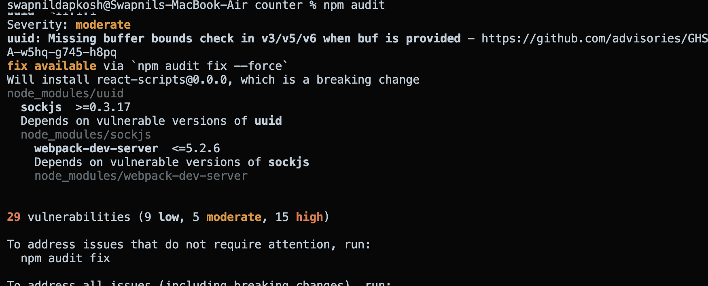
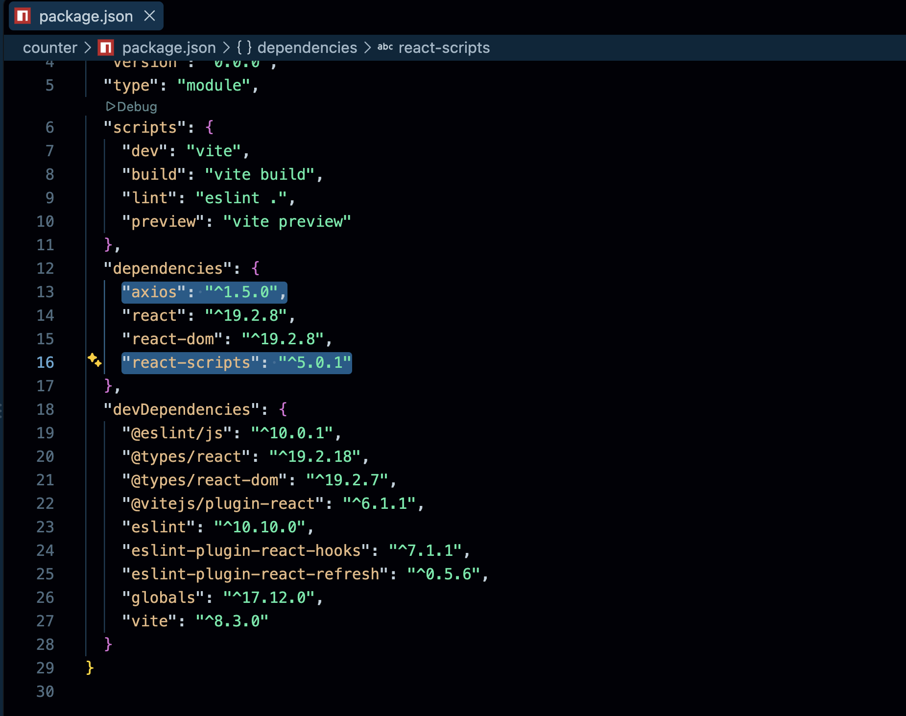

# Software Supply Chain Security Audit & Dependency Analysis

## Overview
This repository contains an end-to-end Software Composition Analysis (SCA) audit of a React.js application. The audit identifies direct and transitive package vulnerabilities, analyzes CVSS v3 metrics, and establishes baseline remediation strategies for enterprise deployment.

## Audit Artifacts & Terminal Outputs

## Dependency Tree Analysis

## Dependency Vulnerability Matrix

| Component | Severity | CVSS v3 | Vulnerability Class | Dependency Type | Remediation Path |
| :--- | :--- | :--- | :--- | :--- | :--- |
| `axios` | High | 7.5 | Prototype Pollution (CWE-1321) | Direct | Upgrade to `1.6.4` |
| `react-scripts` | Critical | 9.3 | Command Injection (CWE-78) | Transitive | Framework Migration to Vite |

## Key Technical Takeaways
- **Direct Patch Management:** Resolved high-severity Prototype Pollution by updating `axios` in `package.json` without introducing breaking changes to the application runtime.
- **Transitive Risk Evaluation:** Identified critical Command Injection risk in `react-scripts` (via `react-dev-utils`). Determined the vulnerability is limited to build-time operations and documented it for formal Risk Acceptance (tracked in Project 2).
- **Supply Chain Visibility:** Analyzed `package-lock.json` to map full dependency trees and isolate unpatched sub-dependencies.
